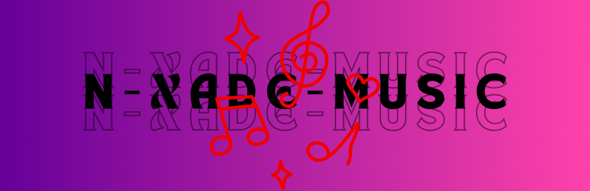

# N-Xade Music Player 🎵

<div align="center">



[](https://www.gnu.org/licenses/gpl-3.0)
[](https://www.android.com)
[](https://flutter.dev)
[](https://f-droid.org/packages/com.nothingnessn.aknmusic/)

</div>

NXade Music Player is an open-source music player application with a modern and user-friendly interface. It has been developed with a focus on privacy, without ads, and completely free.

## ✨ Features

- 🎨 Modern and elegant user interface
- 🎵 Background playback support
- 📱 Notification panel controls
- 📋 Playlist management
- 🔄 Single song repeat feature
- 🎨 Customizable theme options
- 🔒 Privacy-focused - no unnecessary permissions
- 📱 Works on all Android versions (Android 5.0+)
- 💻 Open source

## 📱 Screenshots

<div align="center">


</div>

## 🛠️ Installation

### Requirements

- Flutter SDK (3.x or higher)
- Android Studio / VS Code
- Android SDK
- Git

### Setting Up Development Environment

1. Clone the repository:
```bash
git clone https://github.com/yourusername/n-xade-music.git
```

2. Install dependencies:
```bash
flutter pub get
```

3. Run the app:
```bash
flutter run
```

## 🤝 Contributing

We welcome your contributions! To contribute:

1. Fork this repository
2. Create a new branch (`git checkout -b feature/amazing-feature`)
3. Commit your changes (`git commit -m 'feat: Add amazing feature'`)
4. Push to the branch (`git push origin feature/amazing-feature`)
5. Open a Pull Request

## 📝 License

This project is licensed under the GNU General Public License v3.0 - see the [LICENSE](LICENSE) file for details.

## 📞 Contact

- GitHub: [@NothingnessN](https://github.com/NothingnessN)
- Instagram: [@n_xade_studios](https://www.instagram.com/n_xade_studios/)
- Email: nxadestudios@gmail.com

## 🙏 Acknowledgments

Open source libraries used in this project:

- [just_audio](https://pub.dev/packages/just_audio)
- [audio_service](https://pub.dev/packages/audio_service)
- [provider](https://pub.dev/packages/provider)
- [shared_preferences](https://pub.dev/packages/shared_preferences)

## 🐛 Bug Reporting

If you find a bug or have a feature request, please report it on [GitHub Issues](https://github.com/yourusername/akn_music_flutter_new/issues).

---

<div align="center">
Made with ❤️ in Turkey
</div>
